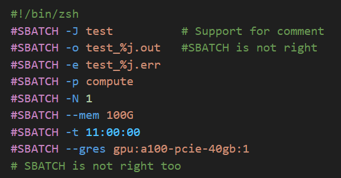

# slurm-- Extension

slurm-- is a multifunctional tool for SLURM syntax highlight, manage tasks, view resource, and launch tasks.

We are continuously developing this extension, if there is a feature you would like to see added or if you encounter a bug, please feel free to give us feedback in [github](https://github.com/XingYuSSS/slurm--)!

## features

### syntax highlight

- Support for shell-like scripts, including `.sh`, `.slrum` or `.sbatch` files, etc.

### task manager

- show slurm running tasks and informations
- record task state, and when they finished
- select multiple running tasks and cancel them

> Click on `stdout` or `stderr` to open the file

### resources viewer

- show availabel resources about nodes and GRES
- launch terminal with chosen GRES

### script launcher

- drop script and one-click launch task

> Drop a script from Explorer to launcher panel  
> Click on script to open the file

## language support

We add multilingual support at version `0.6.0`!

Supported Languages:
- en (English)
- zh-cn (简体中文)

We welcome contributions to add more languages or improve existing translations. If you are interested in helping, please submit a pull request. Thank you for your support!

## License

Slurm-- is licensed under the MIT License - see the [LICENSE](LICENSE) file for details.
